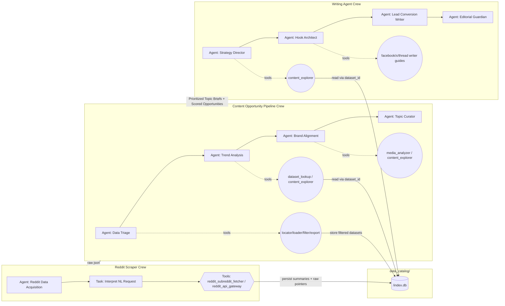
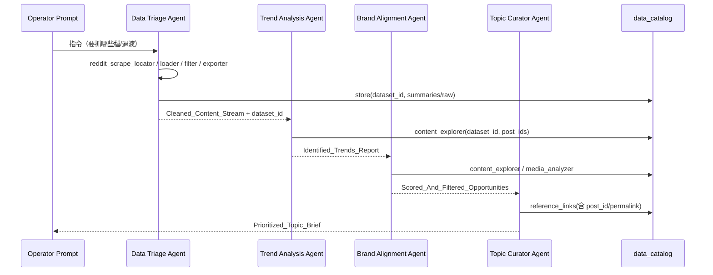

# CrewAI Writing Stack — 全流程深度報告（craw_report）

本報告完整剖析本專案在 `crews/` 目錄下的三個智能體（Reddit Scraper、Content Opportunity Pipeline、Writing Agent）的整體設計、程式結構與運作邏輯，並以具體模擬案例展示每個 Agent 的思考步驟、任務銜接與工具操作。另補充跨模組的優秀設計，包括 Gemini API 節流管理與 `data_catalog/` 的資料永久化設計。內文穿插 Mermaid 圖示協助理解。

- 專案核心路徑：
  - Reddit Scraper Crew：`crews/reddit_scraper/`
  - Content Opportunity Pipeline Crew：`crews/content_opportunity_pipeline/`
  - Writing Agent Crew：`crews/writing_agent/`
  - 共同工具（Gemini 節流）：`crews/common/`

---

## 1. 總覽架構與資料流



關鍵要點：
- 所有 Reddit 原始與精簡後的內容，會以 `dataset_id` 為主鍵持久化到 `data_catalog/<dataset_id>/index.db`，透過工具層（非直接讀檔）檢索。
- Pipeline 只把必要的摘要（如 Trend Report、Scored Opportunities、Topic Briefs）精煉傳遞給 Writing Agent，以降低 Token 壓力。
- Gemini API 呼叫集中由共用節流器管理，避免超出速率限制。

---

## 2. Reddit Scraper Crew

- 入口：`crews/reddit_scraper/crew.py`
- Agent 定義：`crews/reddit_scraper/agents.py`
- 任務定義：`crews/reddit_scraper/tasks.py`
- 工具：`crews/reddit_scraper/tools.py`

### 2.1 Agent 與任務
- `build_reddit_scraper_agent()`（角色：Reddit Data Acquisition Specialist）
  - LLM：`gemini/gemini-2.5-flash`（低溫度，穩定解析意圖）
  - 工具：
    - `reddit_subreddit_fetcher`：結構化抓取子版/用戶貼文與留言（具 `limit/sort/time_filter/comment_depth` 等）
    - `reddit_api_gateway`：任意 Reddit Data API 端點（用於非列表型資料如 `/user/{name}/about`）
- `build_reddit_scraping_task()`
  - 任務重點：將自然語言需求轉為具體工具呼叫規格（JSON 參數），可串多次工具以滿足請求；最後回傳簡要 `request_summary`。

### 2.2 工具詳解
- `reddit_subreddit_fetcher`（`RedditSubredditTool`）
  - 參數：`subreddit | limit | sort | time_filter | comment_depth | skip_media | timeout`
  - 規則：`sort=best` 正規化為 `top`；若未給 `time_filter`，預設 `day` 並記錄於 metadata；`comment_depth='all'` 會展開至無更多節點。
  - 實作：調用 `scrapers/reddit/main_scraper.fetch_subreddit_posts()`，並把成功的 payload 與 metadata 記錄於內部執行日誌。
- `reddit_api_gateway`（`RedditAPITool`）
  - 參數：`endpoint | method | params | data | json | timeout`
  - 實作：透過 `scrapers/reddit/oauth_client.RedditOAuthClient` 以 Client Credentials 認證訪問任意 API，將 JSON 回傳存檔於工具日誌。
- 內部日誌 `_TOOL_EXECUTION_REGISTRY`：每次工具呼叫的輸出與補充 metadata 都會被記錄，方便追蹤與除錯。

### 2.3 模擬案例（思考步驟 + 工具軌跡）

需求：
> 抓取 r/LocalLLaMA、r/OpenAI 熱門（前 50）貼文，留言展開到 1 層，並補充 OP 用戶檔案摘要。

Agent 思考：
1) 需求包含兩個子版、排序 hot、limit=50、留言深度=1 → 適合使用 `reddit_subreddit_fetcher` 各跑一次。
2) 需要 OP 檔案摘要 → 用 `reddit_api_gateway` 呼叫 `/user/{name}/about`。

工具序列（範例參數）：
- `reddit_subreddit_fetcher` x2
  - `{"subreddit": "r/LocalLLaMA", "limit": 50, "sort": "hot", "comment_depth": 1}`
  - `{"subreddit": "r/OpenAI", "limit": 50, "sort": "hot", "comment_depth": 1}`
- `reddit_api_gateway`（對多位作者各發一次）
  - `{"endpoint": "/user/<author>/about", "method": "GET"}`

輸出：
- 任務回覆 `request_summary`（自然語言）
- 實際資料與指標由 Python 管理與後續 Pipeline 工具讀取（避免把整包 JSON 直接貼進 LLM 回應）。

---

## 3. Content Opportunity Pipeline Crew

- 入口：`crews/content_opportunity_pipeline/crew.py`
- Agents：`agents.py`
  - Data Triage Agent
  - Trend Analysis Agent
  - Brand Alignment Agent
  - Topic Curator Agent
- 任務：`tasks.py`
- 工具：`tools.py`（核心：索引、載入、過濾、查詢、匯出、媒體輔助分析）

### 3.1 四個 Agent 定位
- Data Triage Agent（資料分流）：
  - 目標：用工具找出最新的 Reddit 爬取 JSON，生成可追溯資料集（`dataset_id`），並輸出精簡 Cleaned_Content_Stream（預覽 + 匯總指標）。
  - 工具：`reddit_scrape_locator` → `reddit_scrape_loader` → `reddit_dataset_filter` → `reddit_dataset_exporter`
- Trend Analysis Agent（趨勢分析）：
  - 目標：對 Cleaned_Content_Stream 做語意分群、動能與加速度等量化分析，產出 `IdentifiedTrendsReport`。
  - 工具：`reddit_dataset_lookup` / `content_explorer`（必要時取樣貼文、展開留言）
- Brand Alignment Agent（品牌對齊）：
  - 目標：結合品牌知識庫評估每個群集的契合度、風險、漏斗階段，輸出 `Scored_And_Filtered_Opportunities`。
  - 工具：`content_explorer`、`media_analyzer`（檢視影像/影片的輔助指標）
- Topic Curator Agent（策展）：
  - 目標：挑 1–3 個主題，給標題、角度、漏斗與引用，輸出 `Prioritized_Topic_Brief`。

### 3.2 工具生態（重點節錄）

資料集管理（持久化）：
- 內部 `DatasetStore` 會把每次載入/過濾的資料存成一個新的 `dataset_id`，並持久化到 `data_catalog/<dataset_id>/index.db`。
- 內容包含：
  - `metadata`（來源檔清單、子版、建立時間等）
  - `summaries`（精簡欄位：post_id、title、score、permalink、body_preview、raw_pointer 等）
  - `raw`（對應 `raw_pointer` 的完整貼文 JSON 子集）
- 任何後續工具只需提供 `dataset_id` 即可檢索，不需直接讀檔。

核心工具：
- `reddit_scrape_locator`：盤點原始抓取檔案（如 `scraepr_outputs/`）
- `reddit_scrape_loader`：載入 JSON、建索引、產生 `dataset_id`、保存 summaries + raw 子集
- `reddit_dataset_filter`：對既有 `dataset_id` 再過濾（如 `score > 50`、`num_comments > 10`）、排序、取前 N，並回存為新的 `dataset_id`（保留追溯關係於 metadata）
- `reddit_dataset_exporter`：輸出 Cleaned_Content_Stream 預覽（預設只帶少量樣本 + 統計，以控 token）
- `reddit_dataset_lookup`：依 `dataset_id` 與 `post_ids`/`limit` 取回完整 summaries（必要時）
- `content_explorer`：多層級檢視（summary / full_post / full_comments），留言展開有上限（如 100 後代節點）並帶 `truncated` 提示
- `media_analyzer_tool`：對圖片／影片 URL 做摘要輔助（可選）

### 3.3 Mermaid：管線細節



### 3.4 模擬案例（逐步走位）

場景：
> 以 `r/LocalLLaMA、r/OpenAI、r/PromptEngineering` 的最近 7 天新貼為基礎，清洗後挑 1–3 個可做主題。

步驟：
1) Data Triage Agent
   - 用 `reddit_scrape_locator` 找到最近輸出的原始 JSON（目錄 `scraepr_outputs/`）
   - 用 `reddit_scrape_loader` 載入，建立 `dataset_id=A1`，保留 `summaries + raw`（指標如 `score`、`num_comments`）
   - 用 `reddit_dataset_filter` 套規則：`score >= 50`、留言 `score >= 20` 才保留 → 產生 `dataset_id=A2`
   - 用 `reddit_dataset_exporter` 輸出 Cleaned_Content_Stream 預覽（最多 10 筆 preview + 統計）
2) Trend Analysis Agent
   - 讀取 A2 預覽；需要細節時用 `content_explorer(dataset_id=A2, post_ids=[...], data_level=full_post)`
   - 以關鍵詞與互動節奏聚類，產出 `Identified_Trends_Report`（每群含 `cluster_id`、`representative_post_ids`、`trend_velocity/acceleration`）
3) Brand Alignment Agent
   - 對各群以品牌知識庫標準評分（ICP、風險、漏斗），必要時以 `content_explorer` 再看留言情緒
   - 產出 `Scored_And_Filtered_Opportunities`（排序後機會清單）
4) Topic Curator Agent
   - 從機會清單挑選 1–3 題，為每題給出 `topic_title`、`recommended_angles(3–5)`、`target_funnel_stage`、`reference_links`
   - 產出 `Prioritized_Topic_Brief`

---

## 4. Writing Agent Crew

- 入口：`crews/writing_agent/crew.py`
- Agents：`crews/writing_agent/agents.py`
  - Editorial Strategy Director
  - Hook and Narrative Architect
  - Lead Conversion Writer
  - Editorial Guardian
- 任務：`crews/writing_agent/tasks.py`
- 工具：`crews/writing_agent/tools.py`（facebook/x/thread 指南） + `content_explorer_tool`

### 4.1 設計亮點
- 嚴控 Token：`crew.py` 會把 Content Pipeline 的輸入壓縮為最小必要 JSON（只取 Top 5 與精簡欄位），降低上游資訊灌入造成的長提示成本。
- 組織化輸出：以 Pydantic schema `WritingAgentOutput` 統一描述最終成品，包含 `rewrites[]`、`editorial_notes`、`strategic_blueprint`、`hook_concepts`、`quality_review`。

### 4.2 任務銜接
- Strategy Task：從 `prioritized_topic_briefs + scored_and_filtered_opportunities` 中挑出「單一 brief」，整理成 `StrategicBlueprint`（受眾張力、品牌承諾、故事骨幹、STEPPS/心理觸發器、風險）
- Hook Task：依藍圖生成跨平台 `HookConcept[]`（至少兩個，除非指令明確要精簡），必要時查詢 `facebook_writer/x_writer/thread_writer` 工具以取得風格提示
- Writing Task：依主要平台撰寫 `rewrites`（至少一稿），每稿需包含 `supporting_points`（資料/留言證據）與 `references`（`dataset_id + post_id` 或 permalink）
- Quality Task：審核語氣、觸發器落地、引用可追溯，必要時做微調並填入 `quality_review`

### 4.3 Mermaid：寫作細流

```mermaid
flowchart TD
  S[Strategy Director] --> H[Hook Architect]
  H --> W[Lead Conversion Writer]
  W --> Q[Editorial Guardian]

  subgraph Context
    P[Pipeline Compact JSON]
    E[content_explorer(dataset_id,...)]
  end

  P --> S
  S -. verify posts .-> E
  H -. style guides .-> G[(facebook/x/thread writer tools)]
  H --> W
  E -. citations .-> W
  W --> Q
```

### 4.4 模擬案例（v3：Thread + Shortform）

場景：
> 針對 Topic Curator 挑選的首要 brief，輸出兩種變體：X 線程與 Facebook 短稿。

步驟（高層摘要）：
1) Strategy Director：
   - 讀入壓縮後的 pipeline context，定錨受眾張力（例：AI 工具有效落地 vs. 炒作）、品牌承諾（更智慧、更省力、更美好）、3 個關鍵數據點（`dataset_id` 可追溯）
   - 列舉啟用觸發器：資訊差 + 社會認同（KOL/高互動貼文）+ 實用價值（落地指南）
2) Hook Architect：
   - 生成 2–3 個 HookConcept（各含 platform、hook、supporting_promise、trigger_stack、validation_notes）
   - 如針對 X：首句強勢主張 + 條列 3–5 節奏；針對 FB：單段敘事 + CTA
3) Lead Conversion Writer：
   - 產出 `rewrites` 兩稿：
     - X thread：首句（吊胃口）+ 3–5 條列（洞察/招式）+ 結尾提問/行動
     - FB：單段短稿（融入數據/社會認同）+ 明確 CTA
   - `supporting_points` 填資料摘要（引用 `content_explorer` 取得的 `post_id` 指向）
   - `references` 列 `dataset_id+post_id` 或 `permalink`
4) Editorial Guardian：
   - 檢查文案是否符合品牌語氣、引用可回溯與是否真正運用預定觸發器；在 `quality_review` 內給出合規與信心評級

---

## 5. 共同基礎設計

### 5.1 Gemini API 節流管理（crews/common/gemini_rate_limiter.py）
- 全域「每分鐘請求次數」的 FIFO 視窗節流器（預設 `GEMINI_RPM_LIMIT=10`），避免超量導致 API 拒絕。
- 開機補丁：`ensure_gemini_rate_limit()` 會為常見客戶端（`litellm`、`google.generativeai`）動態包裝 `completion/generate_content/send_message` 等入口，在呼叫前先 acquire slot。
- 好處：
  - 所有 Agents 皆可安全共享同一速率配額，不需要在每個 Agent 額外重複實作。
  - 易於調整速率與觀察瓶頸（集中治理）。

### 5.2 資料永久化設計（data_catalog/）
- 每個資料集以 `dataset_id` 分目錄：`data_catalog/<dataset_id>/index.db`
- 實作重點：
  - 三類資料表概念：`metadata`（來源檔、子版）、`summaries`（輕量欄位，帶 `raw_pointer` 與 `dataset_id` 便於回溯）、`raw`（原始貼文/留言子集）
  - 每次 filter 都產生新 `dataset_id`，在 metadata 中保留 `filtered_from` 以維持追溯鏈
  - 查詢透過工具 `reddit_dataset_lookup`、`content_explorer` 完成，不允許 Agent 直接讀檔 → 可控、可審核
- Token 最佳化策略：
  - `reddit_dataset_exporter` 僅輸出 preview（預設 10 筆），附上 `truncated` 與 `limit`，必要時再深挖 → 在多代理溝通中維持最小訊息面積
  - `content_explorer` 的留言展開有上限（如 100 後代），若截斷會回報 `descendants_truncated: true`

### 5.3 CLI 與預設模板（Default_Tasks1.YML）
- `run_content_opportunity_pipeline.py`、`run_writing_agent.py` 都支援以數字載入 `Default_Tasks1.YML` 對應區塊的預設 prompt 與參數（如 `pipeline_output_root/pattern` 與 `default_rewrite_platform`）。
- `run_content_opportunity_pipeline.py` 支援離線 fallback：若無 `GEMINI_API_KEY` 或環境要求，會產生可示範的離線 JSON，方便 Demo 與前端串接。
- 輸出檔會帶時間戳記路徑（例如 `content_pipeline_outputs/YYYYMMDD/HHMM_content_opportunity_pipeline.json` 與 `writing_agent_outputs/YYYYMMDD/HHMM_writing_agent.json`）。

---

## 6. 實作級操作指引（快速上手）

- 產生內容機會（依模板 1）：
  - `python run_content_opportunity_pipeline.py 1`
- 產生寫作成品（依模板 3，X 線程 + FB）：
  - `python run_writing_agent.py 3`
- 直接以自然語言指令（不用模板）：
  - `python run_content_opportunity_pipeline.py "請用最新品牌知識庫，從 r/OpenAI 抓近 7 天並挑 1–3 個主題"`
  - `python run_writing_agent.py "針對 FB 與 X 兩平台產出 2 稿，盡量列出引用 post_id"`

建議配合流程：先執行 Content Opportunity Pipeline（確保 `data_catalog` 建妥與產生最新 pipeline 輸出），再執行 Writing Agent（會自動讀取最新的 pipeline 輸出檔）。

---

## 7. 附錄：常見問題（精選）

- 可以一次處理多個 brief 嗎？
  - 目前 Writing Agent 的 Strategy 任務預設選擇「單一 brief」。若要一次多 brief，可在 CLI 外層以迴圈對多個 brief 分別執行一輪 Writing Agent，或客製化任務描述與輸出結構。

- 可以量產多平台/多稿嗎？
  - 可以。`WritingAgentOutput.rewrites` 是陣列，實作未設硬上限；受限於模型輸出長度與 JSON 結構開銷。若要壓極限建議使用 `writing_agent_v4`（低 token）並在 prompt 明確指定數量與精簡規格。

- 內容引用如何做到可追溯？
  - 工具層在 summaries 內嵌 `dataset_id + raw_pointer.post_pointer`，撰稿階段可透過 `content_explorer` 用 `dataset_id/post_id` 檢索原文或留言樹；最終輸出在 `references` 欄位列出 `dataset_id+post_id` 或 `permalink`。

---

以上內容可作為專案內外部展示用的完整運作說明，涵蓋角色分工、資料流、工具規範與最佳化設計，並輔以實務模擬示例與流程圖，方便跨團隊理解與延伸開發。

